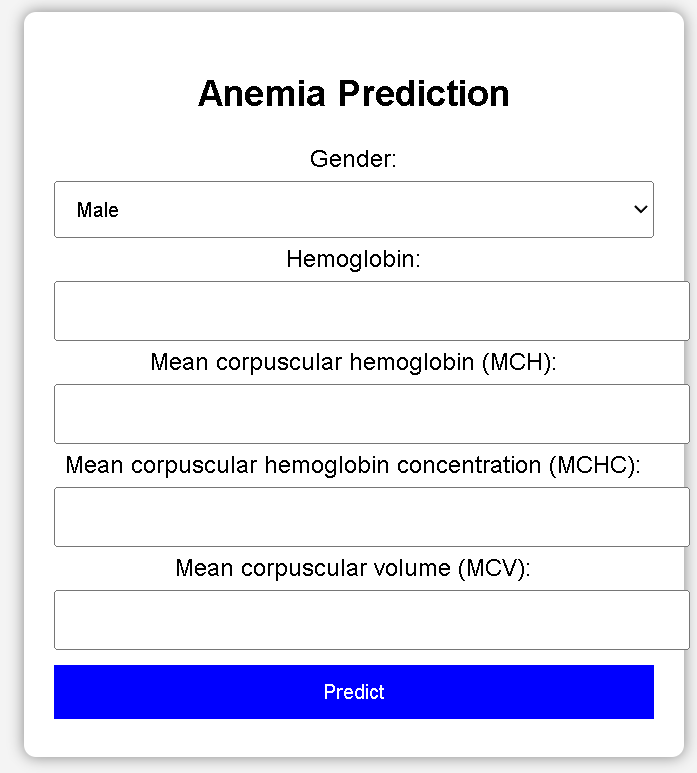
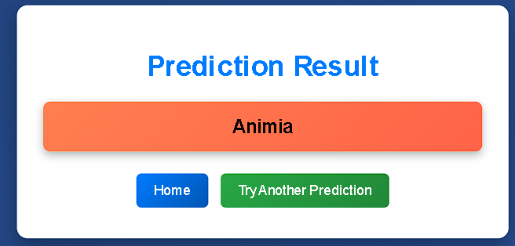

# Anemia Prediction System

This repository contains a Flask-based web application that predicts the likelihood of anemia using a trained machine learning model. It evaluates standard blood test metrics provided via a web interface and returns a diagnostic prediction.

## Project Structure

```text
FLASK/
├── app.py                # Main application script and routing
├── model.pkl             # Serialized predictive model
├── anemia.csv            # Training dataset
├── animia.ipynb          # Model training and data analysis notebook
├── animia_front.png      # Application UI screenshot
├── Backend.png           # System workflow diagram
├── README.md             # Project documentation
└── templates/
    ├── index.html        # Input form template
    └── predict.html      # Results template
```

## Screenshots

**Application Interface**  


**System Architecture**  

## Technology Stack

- **Application Framework:** Flask (Python)
- **Frontend:** HTML5, CSS
- **Data processing & ML:** NumPy, Scikit-Learn, Pandas

## Input Parameters

The application requires the following inputs to generate a prediction:
- **Gender:** 0 (Male) or 1 (Female)
- **Hemoglobin:** Measured in g/dL
- **MCH:** Mean corpuscular hemoglobin
- **MCHC:** Mean corpuscular hemoglobin concentration
- **MCV:** Mean corpuscular volume

The inputs are processed by the backend and passed to the model, which outputs:
- `0`: No Anemia detected
- `1`: Anemia detected

## Setup and Installation

1. Install the required Python dependencies:
   ```bash
   pip install flask numpy scikit-learn
   ```

2. Navigate to the project directory:
   ```bash
   cd FLASK
   ```

3. Start the application server:
   ```bash
   python app.py
   ```

4. Access the application in your browser at `http://127.0.0.1:5000/`.

## Model Information

The model was developed and trained on the provided `anemia.csv` dataset. For details regarding the data preprocessing pipeline and model training, refer to the `animia.ipynb` notebook. The final estimator is exported as a serialized pickle file (`model.pkl`) to be loaded by the application at runtime.
