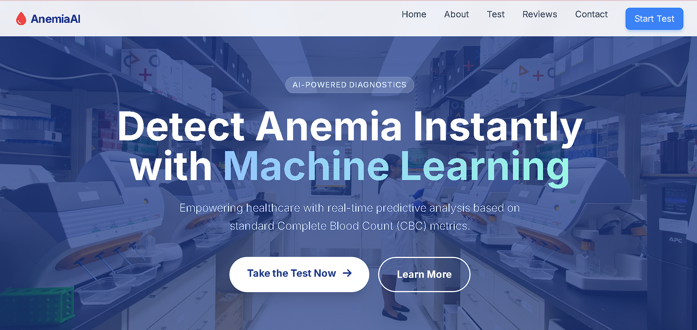
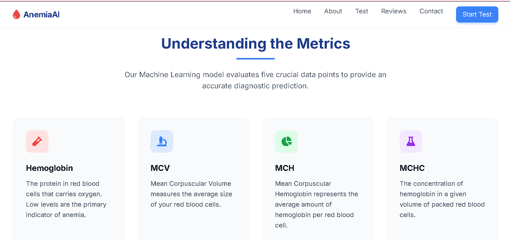
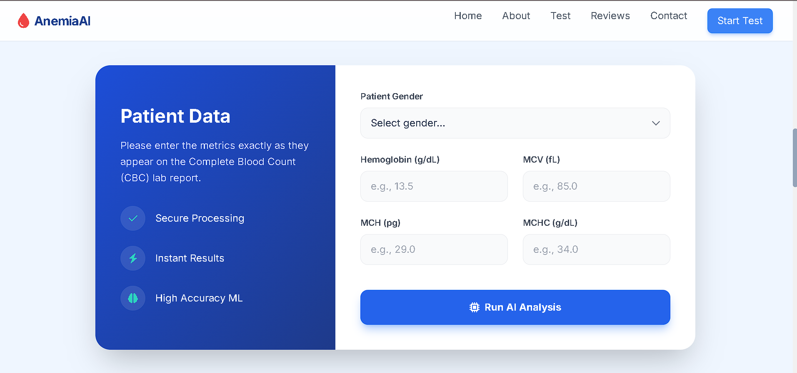
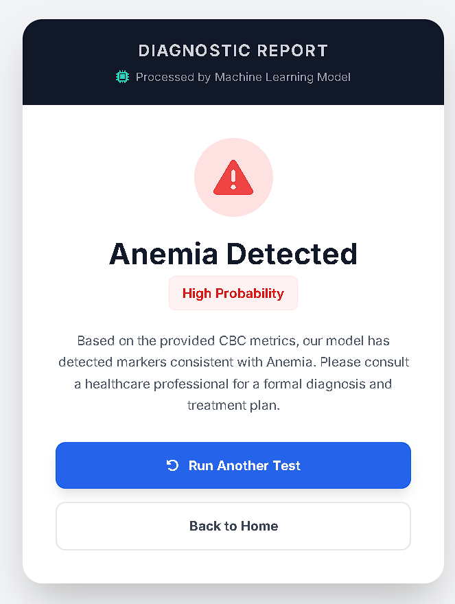

# Anemia AI Predictor

This repository contains a modern, Flask-based web application that predicts the likelihood of anemia using a trained machine learning model. It evaluates standard blood test metrics provided via a web interface and returns an instant diagnostic prediction. 

The application has been entirely redesigned with **Tailwind CSS** to provide a premium, highly interactive, and professional user experience, simulating a real-world medical diagnostic tool.

## Project Structure

```text
FLASK/
├── app.py                # Main application script and routing
├── model.pkl             # Serialized predictive model
├── anemia.csv            # Training dataset
├── animia.ipynb          # Model training and data analysis notebook
├── front1.png            # Screenshot: Home Page
├── front2.png            # Screenshot: Metrics details
├── front3.png            # Screenshot: Test Page
├── pridiction_report.png # Screenshot: Prediction Report
├── README.md             # Project documentation
├── static/               # CSS and other static assets
└── templates/
    ├── index.html        # Main landing page and input form
    └── predict.html      # Diagnostic report template
```

## Application Interface

The application features a multi-section landing page with smooth scrolling, fade-in animations, and a modern medical aesthetic.

### 1. Home Page
A welcoming hero section that introduces the AI-powered diagnostic tool.  


### 2. Understanding the Metrics
A detailed explanation of the Complete Blood Count (CBC) metrics used by our ML model.  


### 3. Patient Data Entry
A secure and clean interface for entering patient data exactly as it appears on a lab report.  


### 4. Diagnostic Report
An easy-to-read, beautifully formatted result page showing the final ML prediction.  


## Technology Stack

- **Backend:** Flask (Python)
- **Frontend:** HTML5, Tailwind CSS, FontAwesome, JavaScript
- **Data Processing & ML:** NumPy, Scikit-Learn, Pandas

## Input Parameters

The application requires the following inputs to generate a prediction:
- **Gender:** Male (0) or Female (1)
- **Hemoglobin:** Measured in g/dL
- **MCV (Mean Corpuscular Volume):** Measured in fL
- **MCH (Mean Corpuscular Hemoglobin):** Measured in pg
- **MCHC (Mean Corpuscular Hemoglobin Concentration):** Measured in g/dL

The backend processes the inputs and passes them to the machine learning model, which outputs:
- **No Anemia Detected**
- **Anemia Detected**

## Setup and Installation

1. Install the required Python dependencies:
   ```bash
   pip install flask numpy scikit-learn pandas
   ```

2. Navigate to the project directory:
   ```bash
   cd FLASK
   ```

3. Start the application server:
   ```bash
   python app.py
   ```

4. Access the application in your browser at `http://127.0.0.1:5000/`.

## Model Information

The model was developed and trained on the `anemia.csv` dataset. For details regarding the data preprocessing pipeline and model training, refer to the `animia.ipynb` Jupyter Notebook. The final estimator is exported as a serialized pickle file (`model.pkl`) to be loaded by the Flask application at runtime.
